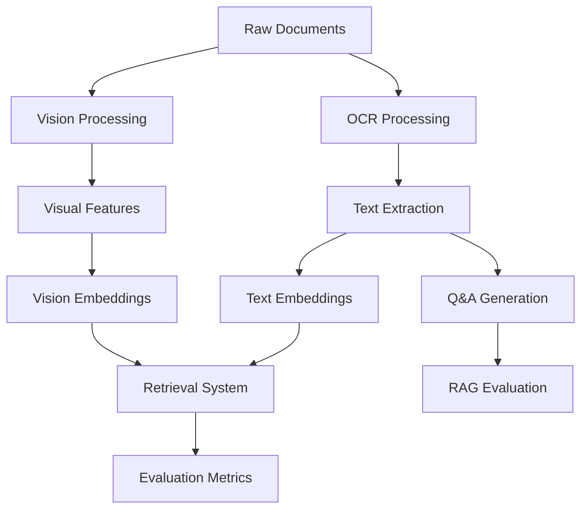

# Project Structure

## Directory Layout

```
lost-in-ocr-translation/
├── src/                          # Source code
│   ├── ocr/                     # OCR processing modules
│   │   ├── __init__.py
│   │   ├── llama_ocr.py         # LLaMA Vision OCR
│   │   ├── nougat_ocr.py        # Nougat OCR
│   │   └── ocr_base.py          # Base OCR interface
│   │
│   ├── retrieval/               # Retrieval modules
│   │   ├── __init__.py
│   │   ├── text_retrieval.py    # Text-based retrieval
│   │   ├── vision_retrieval.py  # Vision-based retrieval
│   │   └── hybrid_retrieval.py  # Hybrid approaches
│   │
│   ├── evaluation/              # Evaluation metrics
│   │   ├── __init__.py
│   │   ├── metrics.py           # Core metrics (MRR, NDCG, etc.)
│   │   ├── ocr_quality.py       # OCR quality metrics
│   │   └── distortion.py        # Distortion level analysis
│   │
│   ├── data/                    # Data processing
│   │   ├── __init__.py
│   │   ├── loader.py            # Data loading utilities
│   │   ├── preprocessing.py     # Preprocessing functions
│   │   └── qa_generation.py     # Q&A pair generation
│   │
│   └── utils/                   # Utilities
│       ├── __init__.py
│       ├── api_clients.py       # API client wrappers
│       ├── embeddings.py        # Embedding utilities
│       └── config.py            # Configuration management
│
├── scripts/                     # Standalone scripts
│   ├── samba_llama.py          # LLaMA OCR extraction
│   ├── new_qa_datagen.py       # Q&A generation
│   ├── rag_llama_measurement.py # RAG evaluation
│   ├── nougat_rag.py           # Nougat RAG evaluation
│   ├── vidore_vlm.py           # Vision model evaluation
│   ├── llama_vidore.py         # ViDoRe on LLaMA
│   ├── levenshtein_per_page_by_degradation.py
│   └── rag.py                  # Basic RAG pipeline
│
├── notebooks/                   # Jupyter notebooks
│   ├── 01_data_exploration.ipynb
│   ├── 02_ocr_comparison.ipynb
│   ├── 03_retrieval_analysis.ipynb
│   └── 04_results_visualization.ipynb
│
├── tests/                       # Unit tests
│   ├── __init__.py
│   ├── test_ocr.py
│   ├── test_retrieval.py
│   ├── test_evaluation.py
│   └── test_data.py
│
├── configs/                     # Configuration files
│   ├── default.yaml            # Default settings
│   ├── llama.yaml              # LLaMA-specific config
│   ├── nougat.yaml             # Nougat-specific config
│   └── vidore.yaml             # ViDoRe settings
│
├── data/                        # Data directory (not in repo)
│   ├── easy/
│   ├── medium/
│   ├── hard/
│   └── ...
│
├── results/                     # Experiment results (gitignored)
│   ├── embeddings/
│   ├── retrieval_results/
│   └── evaluation_metrics/
│
├── docs/                        # Additional documentation
│   ├── API.md                  # API documentation
│   ├── EXPERIMENTS.md          # Experiment details
│   └── DATASETS.md             # Dataset information
│
├── .github/                    # GitHub specific files
│   ├── workflows/
│   │   └── ci.yml             # CI/CD pipeline
│   └── ISSUE_TEMPLATE/
│
├── README.md
├── CONTRIBUTING.md
├── LICENSE
├── requirements.txt
├── requirements-dev.txt
├── setup.py
├── Makefile
└── .gitignore
```

## Module Descriptions

### OCR Modules (`src/ocr/`)
- **llama_ocr.py**: Handles LLaMA Vision model for OCR extraction
- **nougat_ocr.py**: Nougat OCR processing pipeline
- **ocr_base.py**: Abstract base class for OCR implementations

### Retrieval Modules (`src/retrieval/`)
- **text_retrieval.py**: Traditional text-based retrieval using embeddings
- **vision_retrieval.py**: Vision-based document retrieval
- **hybrid_retrieval.py**: Combines text and vision approaches

### Evaluation Modules (`src/evaluation/`)
- **metrics.py**: Core retrieval metrics (MRR, NDCG, Recall@k)
- **ocr_quality.py**: OCR quality assessment (Levenshtein, BLEU)
- **distortion.py**: Document distortion level analysis

### Data Modules (`src/data/`)
- **loader.py**: Handles data loading from various formats
- **preprocessing.py**: Document preprocessing utilities
- **qa_generation.py**: Question-answer pair generation logic

## Key Files

### Configuration Files
- **configs/default.yaml**: Contains default hyperparameters and settings
- **configs/{model}.yaml**: Model-specific configurations

### Scripts
Each script in `scripts/` can be run independently for specific experiments:
- OCR extraction and processing
- Retrieval evaluation
- Comparative analysis

### Notebooks
Jupyter notebooks provide interactive analysis and visualization:
1. Data exploration and statistics
2. OCR system comparison
3. Retrieval performance analysis
4. Result visualization and plotting

## Data Flow



## Usage Patterns

### Running a Complete Experiment

```bash
# 1. Process documents with OCR
python scripts/samba_llama.py --config configs/llama.yaml

# 2. Generate Q&A pairs
python scripts/new_qa_datagen.py --config configs/default.yaml

# 3. Evaluate retrieval
python scripts/rag_llama_measurement.py --config configs/default.yaml

# 4. Analyze results
jupyter notebook notebooks/04_results_visualization.ipynb
```

### Custom Module Usage

```python
from src.ocr import LLaMAOCR
from src.retrieval import TextRetrieval
from src.evaluation import evaluate_metrics

# Initialize OCR
ocr = LLaMAOCR(config_path="configs/llama.yaml")
text = ocr.extract("path/to/image.png")

# Setup retrieval
retriever = TextRetrieval(embedding_model="gte-Qwen2-7B")
retriever.fit(documents)

# Evaluate
results = evaluate_metrics(retriever, queries, ground_truth)
```